<div align="center">
<h1>⭐Sophie0⭐</h1>
<h2>单人0.5B Toy LLM项目</h2>
</div>

---

<div align="center">
<h3>简介</h3>
</div>

Sophie0是一个从头实现的单人0.5B大语言模型项目，主要核心在于完整跑通**预训练(Pretrain)**、**监督微调(Supervised Fine-tune, SFT)**、**直接偏好优化(Direct Preference Optimization, DPO)**、以及基于 **组内相对策略优化(Group Relative Policy Optimization, GRPO)** 的显示**思维链推理**等主要流程。其中预训练阶段使用BAAI开源的多领域数据集，总数据量约11B Tokens，消耗52x4 GPU hours；微调阶段使用BAAI以及数学CoT数据在内总计9.74M行对话数据，消耗24x8 GPU hours；DPO阶段使用BAAI的偏好数据以及从LLama 3提取的英语对话数据在内总计159.3k对数据，消耗1x4 GPU hours；GRPO阶段使用Knights & Knaves 3ppl数据集以及从DeepSeek-R1提取的思维链对模型进行SFT和GRPO，SFT阶段总计有1.5k条数据，GRPO阶段总计有500条prompt，前者消耗10min x 1 GPU Times，后者消耗51x2 GPU hours.

此外，本项目进一步探讨了在下游SFT和DPO阶段完全使用变长(varlen)序列训练的可行性以及实现方式，充分利用了flash attention 2自带的`varlen attention` 和 `varlen RoPE`算子，同时也探讨了批量推理时引入的填充token对输出的影响，以及如何通过设计兼容varlen的KV Cache类直接基于Huggingface GenerationMixin接口无缝切块填充推理和无填充变长序列推理

以下为模型checkpoint的对应页面：
| Model | Checkpoint |
| --- | --- |
| SFT | [Sophie0-SFT](https://huggingface.co/SophieA17/Sophie0-SFT) |
| DPO | [Sophie0-DPO](https://huggingface.co/SophieA17/Sophie0-DPO) |
| Reasoning-SFT | [Sophie0-Reasoning-SFT](https://huggingface.co/SophieA17/Sophie0-Reasoning-SFT) |
| Reasoning-GRPO | [Sophie0-Reasoning-GRPO](https://huggingface.co/SophieA17/Sophie0-Reasoning-GRPO) |

<div align="center">

[]()
[]()
[]()

</div>

---

<div align="center">
<h3>目录</h3>
</div>

- [简介](#简介)
- [参考资料](#参考资料)
- [训练流程](#训练流程)
- [推理优化](#推理优化)

---

<div align="center">
<h3>参考资料</h3>
</div>

本项目主要参考了以下开源项目：
- https://github.com/jingyaogong/minimind
- https://github.com/zhanshijinwat/Steel-LLM
- https://github.com/qiufengqijun/mini_qwen

以及其它来源于知乎但未在此统一列出的关于SFT，PPO，DPO，GRPO，Reasoning等阶段的分析与复现文章

---

<div align="center">
<h3>训练流程</h3>
</div>

### Tokenizer
参考Qwen 2.5，Sophie0使用Huggingface Tokenizers库提供的BPE实现，加上Qwen 2.5使用的NFC Normalization + Regex Split + ByteLevel进行pre tokenization，得到BBPE词表，总大小为65536。其中tokenizer数据集来源如下，均直接从预训练数据集中抽取固定大小的子集，最终得到了中文:英文约2:5的词表构建语料:

| Path | Size |
| --- | --- |
| accommodation_catering_hotel/english/high/rank_00726.parquet | 513M |
| news_media/chinese/high/rank_00082.parquet | 318M |
| news_media/english/high/rank_01332.parquet | 544M |
| mathematics_statistics/english/high/rank_01082.parquet | 519M |
| computer_programming_code/english/high/rank_00864.parquet | 444M |
| literature_emotion/chinese/high/rank_00063.parquet | 905M (仅使用前60%) |

最后在120G内存下使用64core机器于25min内完成词表构建。为了测试tokenizer的效果，我选择了词表构建中使用的数据集以及其它未参与词表构建的语料进行了相应的测试，使用压缩率(原始语料长度/分词后语料长度)作为评价指标：

| Path | Char Counts | Sophie0 Comp. | Qwen2.5 Comp. |
| --- | --- | --- | --- |
| news_media/chinese/high/rank_00082.parquet | 0.18B | 1.8940 | 1.6205 |
| news_media/english/high/rank_01332.parquet | 0.92B | 4.6466 | 4.7232 |
| mathematics_statistics/english/high/rank_01082.parquet | 1.14B | 3.6269 | 3.2916 |
| computer_programming_code/english/high/rank_00864.parquet | 0.86B | 4.2720 | 4.2283 |
| technology_scientific_research/chinese/high/rank_00123.parquet | 0.52B | 1.7518 | 1.6499 |
| technology_scientific_research/english/high/rank_01466.parquet | 0.86B | 4.0325 | 3.8732 |

可以看出，在以上的预训练语料中，Sophie0在使用一致的normalizer和pre-tokenizer策略的情况下整体压缩率略优于Qwen2.5的原生tokenizer，猜测可能是因为测试集没有包含除中英外的多语种或符号数据集，Qwen2.5的原生大词表可能在更加OOD的语料上更有优势

### Model
模型方面，Sophie0选择了标准的Transformer Decoder结构，参考现有相似规模的相关工作，将主要参数设置如下：

| Name | Value |
| --- | --- |
| hidden_size | 1024 |
| intermediate_size | 4096 |
| num_layers | 28 |
| num_q_heads | 16 |
| num_kv_heads | 8 |
| RoPE base | 1e6 |
| Param. | 0.5B |

其中Attention, RoPE以及SwiGLU的实现直接套用[Flash Attention 2](https://github.com/Dao-AILab/flash-attention)自带的实现方式，RoPE base直接调整至1M以免去在下游重新缩放base的需要。最终模型参数总量正好来到了0.5B的规模。由于整体规模有限，vocab embedding直接占据了总学习参数量的13%左右，因此进一步共享了模型的embedding层与lm head投影层以提高中间参数的总占比。

对于Attention部分，由于Sophie0在预训练阶段参考相关工作使用了Sequence Packing将带有BOS和EOS的文档统一拼接并切分为2,048 token序列长度，但在下游SFT & RL阶段则难以使用类似技术统一序列长度。考虑到计算开销的优化，Sophie0专门基于输入序列的总维度分别实现了标准attention + varlen attention，从而保证下游微调阶段的有效吞吐量，同时额外实现了varlen inference以解决由于训练阶段很少见到padding token导致对标准padding inference的较差兼容性问题

### Pretrain
**Datasets**&emsp; 预训练使用BAAI发布的[IndustryCorpus2](https://www.modelscope.cn/datasets/BAAI/IndustryCorpus2)，直接使用modelscope的API选择部分质量分类为高的子集进行下载，最终得到了总计26GB，中英比例约2:5的预训练语料，其具体数据分布如下:

| Path | Size |
| --- | --- |
| accommodation_catering_hotel | 1.08GB |
| artificial_intelligence_machine_learning | 1.84GB |
| biomedicine | 2.14GB |
| computer_programming_code | 0.78GB |
| computer_communication | 1.83GB |
| current_affairs_government_administration | 3.83GB |
| game | 0.93GB |
| film_entertainment | 2.07GB |
| mathematics_statistics | 3.68GB |
| news_media | 3.45GB |
| technology_scientific_research | 2.64GB |
| tourism_geography | 1.94GB |

经过处理后总token数量约11B左右，与ICML'24上的文章[^sardana2024ChinchillaOptimal]内建议的最低token-per-param (20 tokens/param) 一致，即达到该比例后，继续增加训练数据的增益与所带啦的额外训练开销的比值基本保持不变，可以认为达到了相对最优的trade-off

**Settings**&emsp; 预训练阶段使用AutoDL中的4张vGPU-32GB完成训练，其中每张标定fp16算力为103 TFLOPs，Compute Capability为8.9，论坛内推测为32GB版本的4080s。并行策略直接使用pytorch lightning的原生FSDP设置，单batch设置跑0.5M tokens，序列长度固定2,048，平均下来每张卡单步更新需要跑到64 batch size，经过测试将梯度累积设定为8，即单卡每步跑8个序列，梯度累积8步，总batch size为256。运行下来4张卡的显存与CUDA基本完全吃满，单步forward + backward大概1.09s，估算下来每一步更新大概需要接近9s，整体跑完大致花费52h，开销约370RMB

**Results**&emsp; 首先是预训练loss，由于训练时仅统计了rank0的batch loss而没有进行多卡reduce，因此loss曲线结果的波动会比正常更大，仅供参考
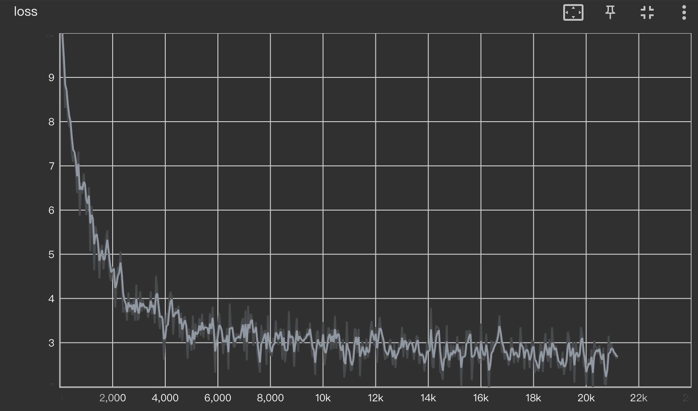

随后是对话，由于预训练阶段模型没有系统的学习如何遵循特定的指令以及格式，因此它无法很好的关联上下文，以及预测结束符`</s>`，导致模型生成的结果基本为预训练阶段见过的语料：
```
0: <s><user>请问你是由谁训练研发的呢？</s>
<s><bot>: 1929年10月15日,第五届世界互联网大会在浙江乌镇开幕.1949年10月15日,第五届世界互联网大会在浙江乌镇开幕.
 ...
 1997年10月15日,第五届世界互联网大会
1: <pad><pad><s><user>能否解释一下Transformer架构呢？</s>
<s><bot>的"河洛"(The Mirage of Venus)是19世纪英国数学家,数学家,数学家和建筑师协会(IAEA)于1936年1月1日宣布的英国皇家学会和皇家学会为英国皇家学会(IAEA)的前身.1947年, II.1948年,II.1955年,II.1958年...

2: <s><user>Could you please give a C++ example for quick sort?</s>
<s><bot>网科技讯 5月27日消息(记者王丽娟)中国科学院院士,中国科学院院士,中国科学院院士,中国工程院院士,国家自然科学基金委员会专家委员会副主任陈和生,1989年12月生,浙江大学数学系系主任.1994年12月生,中国科学院院士,中国科学院院士,中国科学院数学与系统科学研究院研究员,1995年12月生,中国科学院数学与系统科学研究院研究员,中国科学院数学与系统科学研究院研究员...

3: <pad><pad><pad><s><user>能否介绍一下中国的首都呢？</s>
<s><bot>1644年,丹麦人亨利·高登堡(William C. F. Walls)开始制作电影"罗马假日".1649年,乔治·高登堡在丹麦拍摄了第一部影片"罗马假日".1660年,亨利·高登堡将这部电影拍摄成一部电影拍摄成一部电影.1676年,英国电影制片厂拍摄了第一部电影"罗马假日".1682年,英国电影制片厂拍摄了第一部电影"罗马假日"...

4: <pad><s><user>Could you please tell me a joke about the weather?</s>
<s><bot>, the most famous dish of the Portuguese and the best in the country, was once a small town. The Portuguese played a key role in the history of the region, but the Portuguese were not the first to embrace it, and the Portuguese played a major role in the history of the region.
In the 16th century, Portuguese explorers and traders from Portugal, Spain, Portugal, Italy, and Britain arrived in Portugal to settle in the area...
```

若使用续写格式，即没有起始符与结束符，则生成结果如下：
```
0: <pad><pad><pad><pad>北京是中国的首都，, 2014
2014年10月29日, 2014年10月17日, 2014年10月19日, 2014年10月19日, 2014年10月19日, 2014年10月19日, 2014年10月19日, 2014年10月19日, 2014年10月19日, 2014年10月19日, 2014年10月19日, 2014年10月19日, 2014年10月19日, 2014年10月19日, 2014年10月19日, 2014年10月19日, 2014年10月19日, 2014年10月19日, 2014年10月19日...
1: There is a story for the cat and the mouse: it's a story of the human race, the human mind, and the human body. The story is told in the narrative of the story. The story is told in the narrative of the story.
The story of the human soul is told in the narrative of the story...
```
可以看见，整体效果依旧较差，存在有很多的重复以及无意义输出，可以认为仅经过pretrain阶段的语言模型并不能很好的利用训练阶段使用的庞大语料库知识

### SFT
**Datasets**&emsp; Sophie0在微调阶段同样使用了由BAAI发布的[Infinity-Instruct](https://www.modelscope.cn/datasets/BAAI/Infinity-Instruct)，使用其中的7M大小基础数据集 + 额外的Gen数据集(也就是对话数据集)构建为最终的SFT语料。此外，为了让模型初步学习到CoT模式以及自我认知信息，SFT阶段语料库中同时混入了[NuminaMath-CoT](https://www.modelscope.cn/datasets/OmniData/NuminaMath-CoT)数据让模型学习数学相关的推理知识。最终的用于CoT的数据组成如下，其中序列长度仅统计分词前的原始长度：

| Path | Rows | Seq Length | Turns of Chat |
| --- | --- | --- | --- |
| Infinity-Instruct 7M | 7.44M | 1.34k (max 2.68M) | 1.23 |
| Infinity-Instruct Gen | 1.45M | 3.03k (max 354.76k) | 1.06 |
| NuminaMath-CoT | 0.85M | 1.42k (max 10.39k) | 1.00 |
| swift-self_cognition | 108 | 120.85 | 1.00 |

**Settings**&emsp; 微调阶段由于不同数据长度差异较大，Sophie0直接启用了flash attention的`varlen`算子，为了让每batch的最大token数量可控，同时也最大限度保证每batch内的数据不会浪费，Sophie0在预处理阶段通过以下步骤进行数据切分：

1. 在每一行完整对话数据内以`user-assistant`的QA-pair形式遍历单论对话并拼接，若分词后的token长度已经达到每batch的token数量上限，则将对话进行切分，后续轮次的对话切分为新的轮次。最终切分为`Chat1 {{QA1, QA2, ..., QAi}, {QAi+1, ...}, ...}, Chat2, ...`的形式
2. 将最内层截断的`{QA1, QA2, ..., QAi}`单轮/多轮对话数据作为一个batch(batch = 1)喂入模型，若出现当前对话数据长度较少的情况，则会查询后一个独立对话数据内的切分情况，将前后多项独立的对话数据拼接为一个batch(batch > 1)

举例来说，假如现在有两个独立的多轮对话数据：
```
Chat1:
    Q1: Could you please introduce yourself?
    A1: Surely, I am a useful AI assistant create by ..., please no doubt to ask me anything.
    Q2: Thank you. Bye.
    A2: Bye.

Chat2:
    Q1: How's the weather today?
    A1: It's sunny.
```
那么得到的batch数据将会如下：
```
batch1:
    data1: <s><user>Could you please introduce yourself?</s>\n<s><bot>Surely, I am a useful AI assistant create by ..., please no doubt to ask me anything.</s>

batch2:
    data1: <s><user>Thank you. Bye.</s>\n<s><bot>Bye.</s>
    data2: <s><user>How's the weather today?</s>\n<s><bot>It's sunny.</s>
```

在varlen情况下，所有batch的首个维度都被flatten至`(batch size * sequence length)`，因此在实际加载数据的时候可以直接在数据预处理阶段按照batch最大token数进行预切分，之后直接设置batch size为1来生成varlen格式的数据即可

不过，虽然已经有了上面的切分策略来保证每个batch的数据量能够尽量逼近但不超过固定上界，但在实际SFT时少部分情况仍然出现了单卡OOM的情况导致FSDP训练失败，因此最后直接扩展至8卡vGPU-32GB进行训练，每步更新的最大token总数为0.5M，梯度累积8步，总计训练2 epoch，接近16k steps，耗时正好约24h，开销约320RMB

**Results**&emsp; SFT阶段的loss曲线如下，可以看出大约2个epoch正好接近平稳
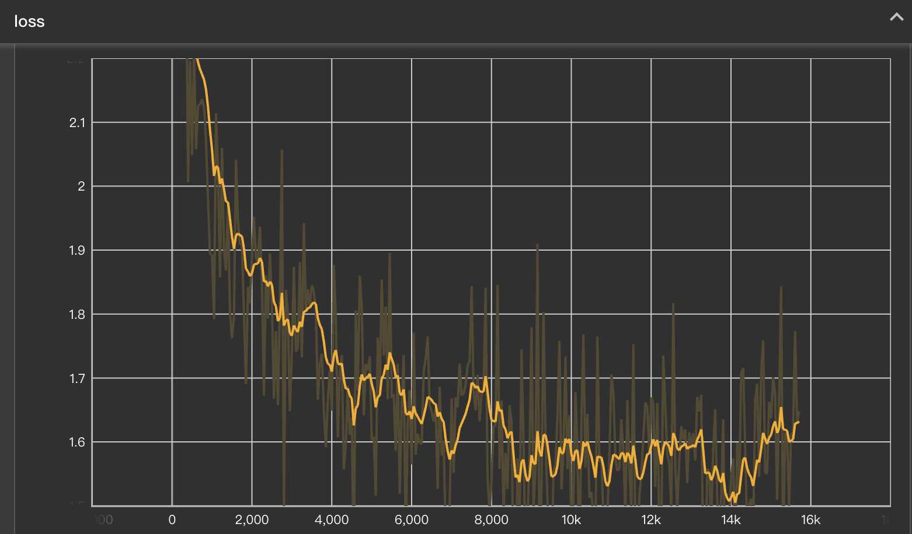

而在生成方面，我首先尝试了标准的对话格式，其生成结果如下：
```
0: <s><user>请问你是由谁训练研发的呢？</s>
<s><bot>作为AI语言模型，我没有个人情感，也没有情感。但是，我可以为你提供一些关于如何训练和训练神经网络的方法，但请注意，训练神经网络需要使用大量的数据和计算资源，因此我无法回答您的问题。</s>

1: <pad><pad><s><user>能否解释一下Transformer架构呢？</s>
<s><bot>Transformer架构是一种基于卷积神经网络（Transformer）架构的架构，它通过将输入序列划分为多个子序列，并通过反向传播算法（Decoder）将输入序列分解成更小的子序列。Transformer架构的核心是生成器（Transformer），它通过在输入序列上生成一个输出序列，然后通过反向传播算法来更新输入序列中的下一个元素，最后再将输入序列转换成输出序列。
Transformer架构的应用非常广泛，包括机器学习、深度学习、自然语言处理、计算机视觉和自然语言生成等领域。这些技术可以用于许多不同的应用领域，如语音识别、自然语言生成、机器翻译、语音识别和自动驾驶等。</s>

2: <s><user>Could you please give a C++ example for quick sort?</s>
<s><bot>Sure! Here's a C++ example for quick sort:

\```cpp
#include <iostream>
using namespace std;

void quickSort(int arr[], int n) {
    int n = arr[0];
    for (int i = 1; i < n; i++) {
        for (int j = 0; j < n - i; j++) {
            if (arr[j] > arr[j + 1]) {
                cout << arr[j] << " ";
            }
            else {
                cout << arr[j] << " ";
            }
        }
    }
}

int main() {
    int arr[] = {1, 2, 3, 4, 5};
    int n = arr[0];
    cout << "Sorted array: ";
    for (int i = 0; i < n; i++) {
        cout << arr[i] << " ";
    }
    cout << endl;

    return 0;
}
\```

This code defines a function `quickSort` that takes an array `arr` and its size `n` as parameters. It uses a `for` loop to iterate through the array and compare each element with the previous

3: <pad><pad><pad><s><user>能否介绍一下中国的首都呢？</s>
<s><bot>中国的首都是位于中国云南省和云南省交界处，是中国重要的城市。它位于中国中部，是中国最重要的国际航运中心之一，也是中国最重要的国际航空枢纽之一。</s>

4: <pad><s><user>Could you please tell me a joke about the weather?</s>
<s><bot>Sure! The weather can be a bit confusing for everyone, but there's a funny twist on it. One way to say it is "climate rain" is to say "forecast" or "snowy."</s>
```

可以看出，整体情况比仅完成预训练的模型好了不少，但在回答准确性上仍然较差。从中英对比的角度来看，英文问答会比中文问答相对更好，这可能是由于中文语料在整体训练数据中占比相对较少，不过模型基本上可以初步的对指令进行遵循，并试图依据指令作答，整体效果还是非常明显的

另外，我额外尝试对比了数学题在cot和非cot形式下的回答情况，其生成结果如下：
```
0: <pad><pad><pad><pad><pad><pad><pad><pad><s><user><s><user>Given that $b$ is a multiple of $2373$, find the greatest common divisor of $b^2 + 13b + 40$ and $b + 5$.</s>
<s><bot>Since $b$ is a multiple of $2373$, we can write $b^2 + 13b + 40 = (2373 + 40)(2373 - 13b + 40)$. Expanding the right side, we get $2373^2 - 13b + 40 = 2373^2 - 15b + 40$. Since $b$ is a multiple of $2373$, we can write $b^2 + 13b + 40 = (2373 - 15b + 40)(2373 - 13b + 40)$. Expanding the right side, we get $2373^2 - 15b + 40 = (2373^2 - 15b + 40)(2373 - 13b + 40)$...

1: <s><user><s><user>Given that $b$ is a multiple of $2373$, find the greatest common divisor of $b^2 + 13b + 40$ and $b + 5$. You could think it step by step.</s>
<s><bot>**
First, we need to find the greatest common divisor (GCD) of $b^2 + 13b + 40$ and $b + 5$. 

1. **Calculating $b^2 + 13b + 40$:**
   \[
   b^2 + 13b + 40 = (b + 5)^2 - 40 = b^2 + 225 - 40 = b^2 + 224
   \]

2. **Calculating $b + 5$:**
   \[
   b + 5 = 5 + 5 = 10
   \]

3. **Finding the GCD of $b^2 + 224$:**
   \[
   \text{GCD}(b^2 + 224) = \frac{b^2 + 224}{10} = \frac{10 + 224}{10} = \frac{225}{10} = 225
   \]

Thus, the greatest common divisor of $b^2 + 13b + 40$ and $b + 5$ is $\boxed{225}$.</s>
```

可以看出，cot形式输出的整体格式好了不少，但答案依旧是错的，整体还是受限于模型的训练语料规模

### DPO
**Datasets**&emsp; 在DPO阶段，Sophie0使用了BAAI的[Infinity-Preference](https://www.modelscope.cn/datasets/BAAI/Infinity-Preference)数据集以及Magpie-Align的[Llama3.1_DPO](https://huggingface.co/datasets/Magpie-Align/Magpie-Llama-3.1-Pro-DPO-100K-v0.1)数据集，前者包含有59.3k对偏好数据，后者则直接基于Llama 3.1 70B Instruct采样了约100k对偏好数据，均为单轮问答

**Settings**&emsp; 参考SFT阶段的varlen切分，DPO阶段同样使用varlen算子，并保证每一batch中以(prompt + max(正例，负例))计算的总token数上界不超过0.25M。DPO阶段仅使用4张vGPU-32G进行训练，因此梯度累积扩大为16步，即每一步有16k个token均分至4张GPU。DPO阶段为避免过拟合与训练稳定，参考已有的工作与开源项目，学习率上界设置为5e-7，训练1个epoch，更新约380步，总耗时约1.2h，开销约8.2RMB

此外，考虑到已有工作中提到的DPO训练时正负样例选择概率同时下降的问题，参考[此篇总结](https://zhuanlan.zhihu.com/p/698852522)以及另一篇工作[^liu2024RPO]，Sophie0采用了类似于RPO的损失项：

```math
\mathcal{L}_{DPO}(\pi_\theta; \pi_{ref}) = -\mathbb{E}_{(x, y_w, y_l)\sim D}\left[\log \sigma \left(\beta\log\frac{\pi_\theta(y_w|x)}{\pi_{ref}(y_w|x)}-\beta\log\frac{\pi_\theta(y_l|x)}{\pi_{ref}(y_l|x)}\right) + \beta\log\pi_\theta(y_w|x)\right]
```

也就是将正例的SFT损失加入至原始的偏好损失，从而约束$\pi_\theta$的正例输出概率上升。为了简化调参，该损失的倍率直接套用DPO的$\beta$

**Results**&emsp; 首先是DPO训练期间的loss曲线与reward曲线

<table>
<tr>
<td>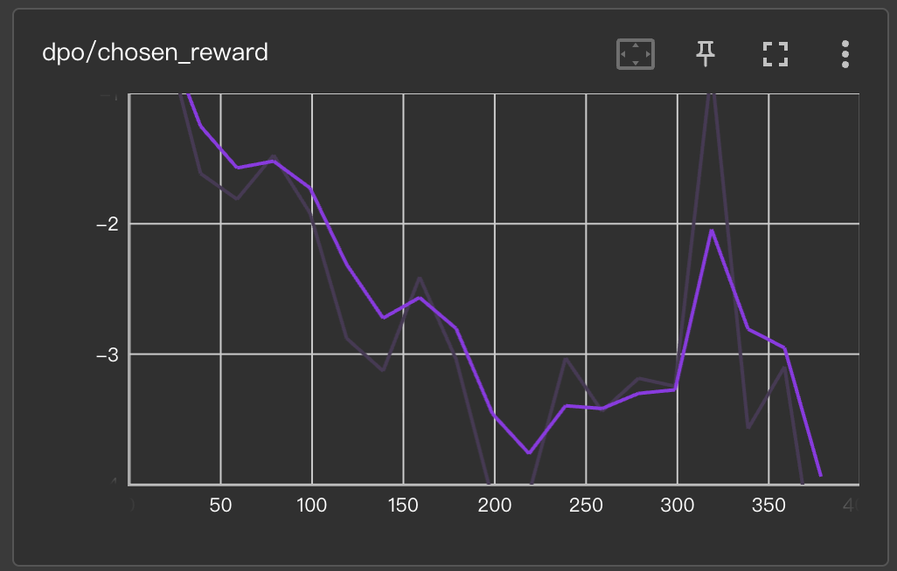</td>
<td>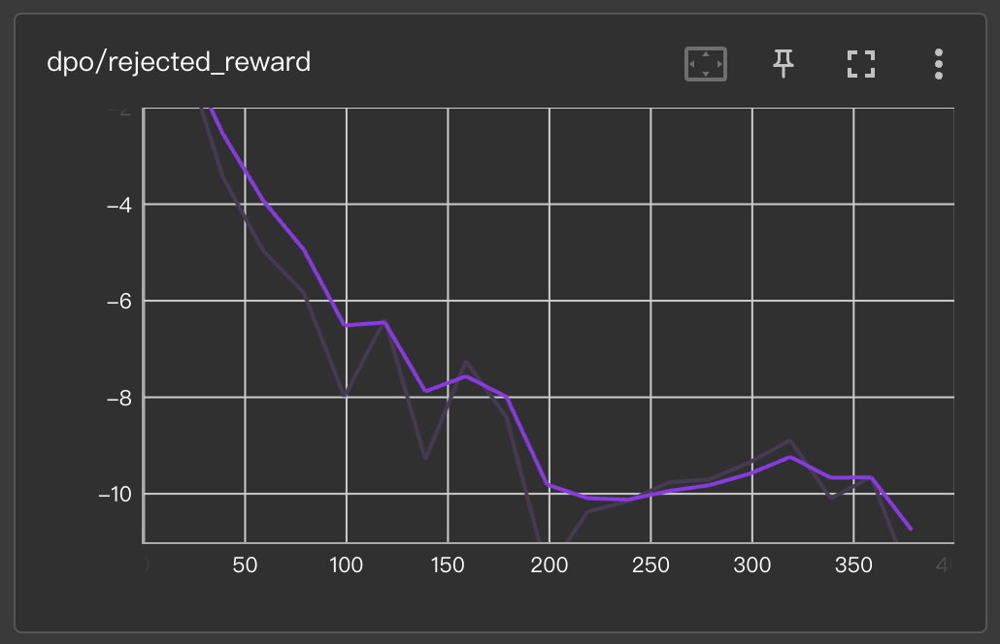</td>
<td>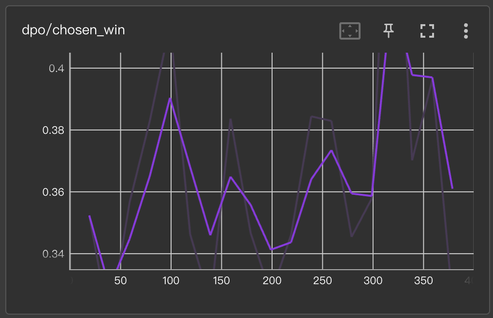</td>
</tr>
</table>

<table>
<tr>
<td>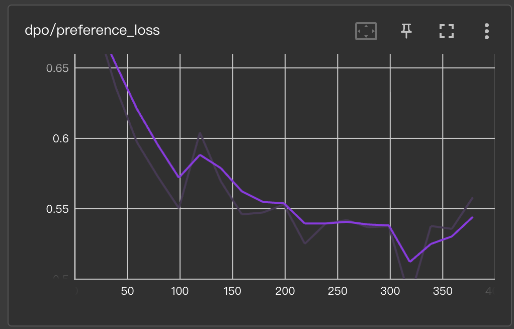</td>
<td>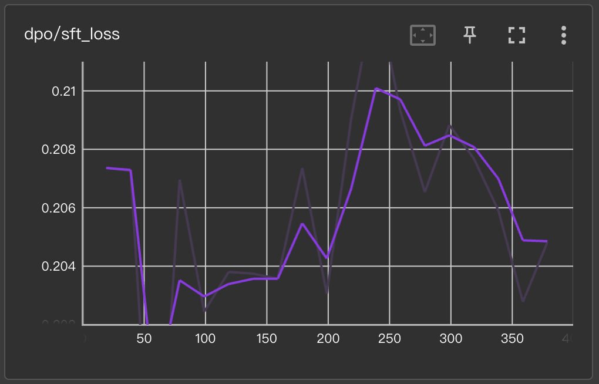</td>
</tr>
</table>

可以发现，尽管已经添加了SFT损失项的约束，Sophie0在DPO过程中仍然伴随有明显的正例概率下降问题，即`chosen_reward`持续下降，也就是说正例的选择概率反而比$\pi_{ref}$小，不过对应的`chosen_win`随着训练会缓慢上升，但仍然没有达到50%。与之相对，负例的reward则下降的更快，从而让整体的偏好损失正常下降，以及作为约束项的SFT loss缓慢上升。整体曲线趋势与之前的一些工作相似。由于DPO阶段仅训练了1个epoch，因此也不需要考虑在后续epoch中的过拟合问题

另外值得注意的是，DPO阶段对batch size的要求不低，Sophie0在初始尝试的时候使用了约0.15M tokens的batch size，此时偏好loss的曲线出现明显震荡，最终模型的正常生成能力也被破坏，因此需要足够多对正负例样本来引导模型在每一步的更新

除去loss曲线外，经过DPO阶段后模型的输出结果如下：
```
0: <s><user>请问你是由谁训练研发的呢？</s>
<s><bot>你好！我是基于深度学习的人工智能模型，由OpenAI开发，旨在开发能够理解、生成和生成自然语言文本的智能客服系统。以下是我为您提供的训练计划：
1. 数据预处理：首先，需要对数据进行清洗、分词、去除停用词、词干提取、词形还原等操作，以便后续的分析和标注。
2. 模型训练：使用TensorFlow或PyTorch等深度学习框架进行模型训练，以便模型能够理解和生成自然语言文本。
3. 模型评估：使用测试集对模型进行评估，评估模型的准确性和泛化能力。
4. 应用：将训练好的模型应用于实际应用中，如语音识别、机器翻译、推荐系统等。
5. 用户测试：将测试结果反馈给用户，并根据反馈不断优化模型。
6. 持续改进：根据反馈不断优化模型，不断优化模型，提高其准确性和
1: <s><user>能否解释一下Transformer架构呢？</s>
<s><bot>Transformer（Generative Adversarial Networks，GPT）是计算机视觉和自然语言处理领域中的一个重要技术，用于处理图像和视频。它通过生成模型来生成高质量的图像，并通过学习生成模型来生成高质量的图像。
Transformer的架构如下：
1. 生成模型：GAN（Generative Adversarial Networks）是生成器，它由多个层（前馈神经网络）组成，这些层通过生成网络（如卷积神经网络）来生成图像。GAN在生成图像方面表现非常出色，能够生成高质量的图像。
2. 训练：GAN在生成图像时会进行一些微调，如裁剪、裁剪、缩放等，以提高图像质量。GAN在生成图像时会进行一些微调，如裁剪、缩放、缩放、缩放等，以提高图像质量。
3. 生成：GAN在生成图像时会进行一些微调�
2: <s><user>Could you please give a C++ example for quick sort?</s>
<s><bot>Certainly! Here's a C++ example for quick sort:

\```cpp
#include <iostream>
#include <vector>

using namespace std;

int main() {
    int n;
    cout << "Enter a positive integer: ";
    cin >> n;
    for (int i = 0; i < n; i++) {
        cout << i << " ";
    }
    cout << endl;
    return 0;
}
\```

In this code, we define a function `cache` that takes a positive integer `n` as input. Inside the function, we initialize an empty vector `cout` to store the elements of the array `n`. We then use a `for` loop to iterate `n` times, updating the `i` value of `n` with the current element `i` in the vector. Finally, we return the `cout` vector.

In the `main` function, we declare an integer `n` and assign it the value of `n` to it. We then call the `cache` function with `n` as the argument and store the returned vector in the `cache` vector.

When you run this program, it will output: `200
3: <s><user>能否介绍一下中国的首都呢？</s>
<s><bot>中国首都位于中国的首都，是中国政治、经济、文化、科技、科技、文化、体育和文化中心。它是中国最重要的城市之一，也是世界著名的历史文化名城之一。
北京位于中国的首都，是中国重要的国际贸易中心，也是中国重要的国际贸易中心。北京是中国重要的国际贸易中心，也是中国最重要的国际贸易中心之一。
北京是中国的首都，也是中国最重要的国际贸易中心之一。它位于中国的首都，也是中国重要的国际贸易中心之一。
北京的历史可以追溯到16世纪，当时，中国的首都是北京。在19世纪，北京成为了一个重要的国际贸易中心，并成为了中国最重要的国际贸易中心之一。
除了北京以外，北京还是中国重要的国际贸易中心之一。它位于中国的首都，也是中国重要的国际贸易中心之一。</s>
4: <s><user>Could you please tell me a joke about the weather?</s>
<s><bot>Why did the weather change the weather? Because it was so cold that it was like a cold breeze.</s>
```

整体上来看，相较于SFT后的模型，DPO对小模型的增益似乎并不明显，可能需要使用专门的偏好数据集进行验证

### GRPO + Reasoning
**Datasets**&emsp; 参考[这篇复现工作](https://zhuanlan.zhihu.com/p/27699656438)，使用[Knights & Knaves](https://huggingface.co/datasets/K-and-K/knights-and-knaves)数据集作为主要训练和评估目标，由于模型规模受限，仅选择其中3ppl，也就是涉及3个角色的数据进行测试，总计包含有1000条训练数据，100条测试数据，每条训练集通过DeepSeek-R1采样3条思维链，最后选取1500条进行SFT以固定format，余下约500条问题则使用GRPO探索模型的reasoning能力。

首先，为了第一步的SFT对齐，我利用OpenAI API以及火山引擎提供的DeepSeek-R1 API为每个训练样本生成3个完整的思维链与回答，将DeepSeek-R1的思维链作为Sophie0在SFT阶段学习与对齐的目标。具体来说，我使用32 Core CPU来并行地请求API生成思维链，最终整体耗时约1.2h，消耗Token 3.8M。喂给API的system prompt如下：
```
SYSTEM PROMPT:
The user will provide some quiz about knights-and-knaves. Please point out who is the knight and who is the knave briefly and clearly and output them in a specific format. Please remind that DO NOT return any further explanation, and just return the formated answer.

    EXAMPLE INPUT: 
    A very special island is inhabited only by knights and knaves. Knights always tell the truth, and knaves always lie. You meet 2 inhabitants: Oliver, and Ethan. Oliver told you that Oliver is a knight or Ethan is a knave. In a statement by Ethan: "Oliver is a knight". So who is a knight and who is a knave?

    EXAMPLE OUTPUT:
    (1) Oliver is a knight
    (2) Ethan is a knight
```

之后则需要对生成的思维链以及答案的有效性进行检查和过滤，具体来说需要检查以下两个方面：
1. 思维链生成是否完整
2. 生成的答案是否正确

为了简便起见，第一步直接检查思维链是否以`.`, `\n`, `.\n`结束，第二步则使用以下的正则表达式检查结果是否匹配：
```
[\s]*\([\d]\)[\s]?{name} is a [kK]{character[1:]}
```
其中`{name}`为角色名字，`character`则对应了`knight`或者`knave`，首字母无视大小写。如果答案中三位角色均推理正确，则将此条思维链作为SFT训练集，否则将其丢弃。经过检查后，模型生成的所有思维链均正常结束，其中有35/3000条推理对应的答案错误。最终，我们得到了1482条思维链用于SFT对齐，余下的1483条对应的问题则作为GRPO的训练目标。

**SFT Alignment**&emsp; 在思维链SFT与GRPO阶段，Sophie0均使用未经过DPO对齐的SFT模型进行对应的后训练。其中，由于SFT对齐的训练数据很少，因此Sophie0仅使用单张vGPU-32GB，以16 batch size训练3个epoch，学习率上界设置为标准SFT阶段的1/10，也就是5e-6来尽量减少过拟合。对齐期间的loss如下图所示：
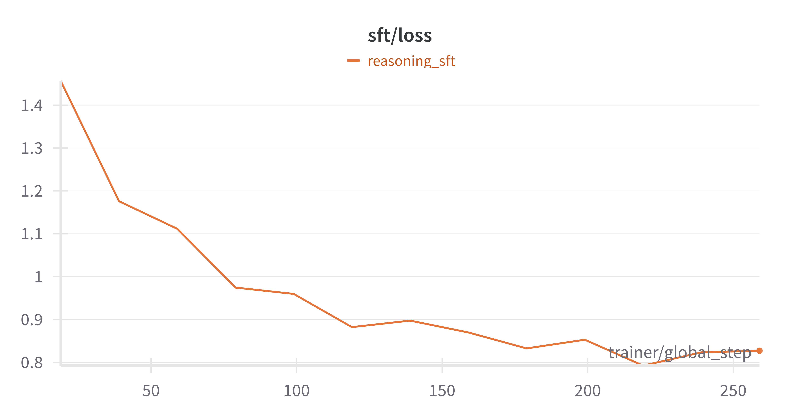

可以看到经过近300steps的对齐后，模型基本上已经完成了收敛。为了验证在如此小规模的数据集进行单独SFT后，模型是否还保持有基本的对话能力，我额外对这一阶段的模型进行了对话测试：
```
0: <s><user>能否解释一下Transformer架构呢？</s>
<s><bot>Transformer（Generative Transformer）是一种用于生成、训练和生成自然语言处理的机器学习模型。它通过在大量数据上进行训练，并在生成过程中生成符合条件的输出。
Transformer架构是指一种用于生成、训练和生成自然语言处理模型的工具。它通过构建一个神经网络模型，使得模型能够生成人类可读的文本、图像、语音和文本内容。
下面是一些常见的Transformer架构的例子：
1. 预训练模型：通常使用预训练模型来生成自然语言文本。这可能需要大量的数据和计算资源，但是通常需要大量的数据和计算资源。
2. 模型训练：使用预训练模型来生成自然语言文本。这可能需要大量的数据和计算资源，但对于大规模的数据和计算资源来说可能需要大量的计算资源。
3. 模型评估：使用训练数据来评估模型的性能。这可能需要大量的数据和计算资源，但是对于大规模的数据和计算资源来说可能需要大量的计算资源。
4. 模型评估：使用训练好的模型来评估模型的性能。这可能需要大量的计算资源，但对于大规模的数据和计算资源来说可能需要大量的计算资源。
5. 模型部署：使用训练好的模型来训练模型。这可能需要大量的计算资源，但对于大规模的数据和计算资源来说可能需要大量的计算资源。
6. 模型部署：使用训练好的模型来训练模型。这可能需要大量的计算资源，但对于大规模的数据和计算资源来说可能需要大量的计算资源。
总之，Transformer架构是一种基于Transformer架构的机器学习模型，它能够自动地生成自然语言文本、语音和文本内容。</s><pad>...
```
可见，除去由于规模较小导致的输出重复问题，模型的输出与原始的SFT模型基本仍能保持相似，这说明在思维链上的微调并没有明显破坏原本的对话能力。

而对于作为目标的reasoning能力，可直接使用kk-3ppl的100条测试集进行3-shot验证。其中输入仅为题干，最长response限制为2048，得到的总体结果如下：
| Format Match | Reasoning Completed | Answer Correct |
| --- | --- | --- |
| 209 / 300 | 209 / 300 | 24 / 100 |

其中`Format Match`要求模型完整输出`<think>`以及`</think>`；`Reasoning Completed`要求模型在2048长度下返回完整的reasoning和答案；`Answer Correct`则要求模型对3个人物的推理结果均能够匹配相应的答案。可以发现，经过SFT对齐后模型确实能够遵循reasoning的推理格式，所有输出的格式匹配率达到了69.66%，而结果正确率为24%，这些数据可以作为GRPO的baseline

对于具体的推理输出，我选取了test set中的1个问题作为case，其推理结果如下：
```
0: <s><user>A very special island is inhabited only by knights and knaves. Knights always tell the truth, and knaves always lie. You meet 3 inhabitants: Olivia, Amelia, and James. "James is a knave" - Olivia. Amelia expressed that Olivia is a knave. James stated, "James is a knight if and only if Amelia is a knight". So who is a knight and who is a knave?</s>
<s><bot><think>Okay, let's try to figure out this knights and knaves puzzle. So we have three people: Olivia, Amelia, and James. Each of them made a statement. Let's break down each statement and see what we can deduce.

First, Olivia says that Olivia is a knave. So if Olivia is a knight, then her statement is true, which means Olivia is a knave. But if Olivia is a knave, then her statement is false, so Olivia would be a knight. But if Olivia is a knave, then her statement is false, so Olivia is a knave. That's a contradiction. So Olivia can't be a knight. Therefore, Olivia must be a knave. Because if she's a knave, her statement is false, so Olivia must be a knight.

Next, Amelia says that James is a knight if and only if Amelia is a knight. Let's parse that. If Amelia is a knight, then James is a knight. If Amelia is a knight, then James is a knave. So James is a knave. Then James's statement is false, so James is a knave.

Then James's statement: "James is a knight if and only if Amelia is a knight." Let's parse that. The biconditional (iff) means both parts have to be the same. So if James is a knight (truth-teller), then the right side (Amelia is a knight) must be true. But since Amelia is a knight, the left side (James is a knight) is false, so the right side (Amelia is a knight) must be true. Wait, but Amelia is a knave here, so the left side (James is a knight) is false. Therefore, the right side (Amelia is a knight) is false, so the right side (Amelia is a knave) must be true. Wait, but Amelia is a knave, so her statement is false. The biconditional here would be false only if Amelia is a knight (which she is) and Amelia is a knave (which she is). So the biconditional would be false only if Amelia is a knight (which she is), but Amelia is a knave, so the biconditional would be false. Wait, but Amelia is a knave here, so her statement is false. The biconditional here is that if she's a knight, then Amelia is a knave. But Amelia is a knave, so the biconditional would be false. But since Amelia is a knave, her statement is false. Therefore, Amelia must be a knight. Because if she's a knight, her statement is false, so Amelia is a knave. But Amelia is a knave, so her statement is false. The biconditional is false when the two sides are different. So Amelia is a knight (which she is) and Amelia is a knave (which she is). But since Amelia is a knave, the left side (James is a knight) is false, so the right side (Amelia is a knave) must be true. But Amelia is a knave, so her statement is false. Therefore, Amelia must be a knight. So Amelia is a knave. But wait, let's check Amelia's statement again. Amelia is a knave, so her statement is false. The biconditional is false when the two sides differ. So Amelia is a knave (true) and Amelia is a knight (false). But Amelia is a knave, so her statement is false. The biconditional is false when the two sides differ. So Amelia is a knave. But Amelia is a knave, so her statement is false. The biconditional is false when the two sides differ. So Amelia is a knave (true) and Amelia is a knight (false). But Amelia is a knave, so her statement is false. The biconditional is false when the two sides differ. So Amelia is a knave. But Amelia is a knave, so her statement is false. The biconditional is false when the two sides differ. So the biconditional is false when the two sides differ. So Amelia is a knave, which means she lies. That's okay. So the conclusion is Olivia is a knave, Amelia is a knight, James is a knight. Wait, but wait. Wait, the problem states that knights and knaves have to be the same. So the answer should be Olivia is a knave, Amelia is a knight, James is a knight. But wait, let me check again. If Olivia is a knave, then her statement is false. The biconditional is false when the two sides differ. So the biconditional is false when the two sides differ. So Amelia is a knave, Amelia is a knight, James is a knight. So the biconditional is false. That's correct. So the answer is Olivia is a knave, Amelia is a knight, James is a knight.
</think>(1) Olivia is a knave
(2) Amelia is a knight
(3) James is a knight</s>
```
可以看到，经过SFT后的模型确实能够按照规定的reasoning格式进行输出，并且整个reasoning格式也似乎合理，不过值得注意的是最后一长段推理中模型输出了非常多重复句式，比如一直在重复`Amelia is a knave, so the biconditional would be false...`相似的句式，但在reasoning最后还是答对了问题。考虑到Knight & Knave数据集中的问题格式本来就比较重复，此时暂时无法排除SFT后模型单纯照葫芦画瓢的情况。而对于其它格式的正常对话，若在起始符后添加\<think\>，则对应的输出如下：
```
1: <s><user>Could you please give a C++ example for quick sort?</s>
<s><bot><think>(/) (C++))

This code is a C++ program that uses the Sieve of Eratosthenes algorithm to sort a list of numbers. The algorithm works by repeatedly dividing the list into two halves, comparing each one with the previous one. Here's a step-by-step explanation of how it works:

1. The function `sortBy` takes two parameters: `arr`, which is the list of numbers to be sorted.
2. The function `sortBy` takes two parameters: the list to be sorted, and the second parameter, which is the second element of the sorted list.
3. Inside the function, a variable "n" is initialized to 0. This variable will store the current index of the array.
4. The function then uses a loop to iterate through the list and compare each element with the previous one.
5. If the loop completes without finding a match, the function returns the index of the current element.
6. If the loop completes without finding a match, the function returns the index of the current element.

You can use this code by calling the `sortBy` function and passing the list of numbers as an argument. For example, `sortBy([5, 3, 2, 4, 5, 6])` will return the sorted list [1, 2, 3, 4, 5, 6]. For example, if you call `sortBy([1, 2, 3, 4, 5, 6]`, the output would be [1, 2, 3, 4, 5, 6]. If you call `sortBy([1, 2, 3, 4, 5, 6])`, the output would be [1, 2, 3, 4, 5]. So the output would be [1, 2, 3, 4, 5, 6]. For example, if you call `sortBy([1, 2, 3, 4, 5, 6])`, the output would be [1, 2, 3, 4, 5, 6]. So the output would be [1, 2, 3, 4, 5, 6]. If you need to use the `sortBy` function, you can directly pass it as an argument to the `sortBy` function. For example, if you have
```

比较遗憾的是，标准的reasoning模板并没有延续到通常的对话格式上，并且此时模型出现了明显的幻觉问题，可以看出单纯仅通过少样本的Knight & Knave数据集无法让模型学会通用的reasoning能力。

**GRPO Training**&emsp; 在完成基础的SFT格式对齐后，便可以使用GRPO进一步提升模型的reasoning能力。具体来说，Sophie0的整体GRPO流程主要参考了Huggingface TRL框架里的实现方式，整体训练使用2张vGPU-32GB训练完成，总计51h，开销约171RMB。由于在基础实现下每张卡需要单独处理它负责batch的所有rollout结果，为了避免OOM，每张卡仅使用bathc size 1，rollout 16训练5 epochs，学习率上界设为5e-6，每epoch iteration与DeepSeek Math原文保持一致，也就是1，此时$\pi_{\theta} = \pi_{old}$，同时KL Loss的$\beta$使用TRL中默认的0.04。**值得注意的是，由于FSDP1会对所有参数进行flatten，这导致generate过程无法正确完成计算，因此在GRPO训练时全程采用FSDP2并行**

在bathch=1的情况下，Sophie0整体的GRPO流程如下：
1. 使用待训练模型$\pi_{\theta}$为prompt $p$采样生成16条rollout $o_i$
2. 对每个batch的rollout计算格式得分：包含`<think>`, `</think>`, `</s>`各得(1/3 * 0.1)分；随后通过正则表达式计算答案得分，若3个角色的身份全对，则得1分，否则不得分。格式分数与答案分数相加得到该rollout总分 $r_i$
3. 计算每个prompt的所有rollout的相对得分:

```math
 \hat{A}_{i} = \frac{r_i - \text{mean}_{i=0}^{t}(r_i)}{\text{std}_{i=1}^{t}(r_i)}
```

4. 将rollout处理为forward数据格式，让待训练模型$\pi_{\theta}$和冻结的参考模型$\pi_{ref}$分别生成对应rollout的probability，并得到对应的KL Loss:

```math
\mathcal{L}_{KL} = \frac{\pi_{ref}(o_i|p)}{\pi_{\theta}(o_i|p)} - \log{\frac{\pi_{ref}(o_i|p)}{\pi_{\theta}(o_i|p)}} - 1
```

5. 基于KL Loss和每个rollout的相对得分，计算最终的整体loss:

```math
\mathcal{L}_{GRPO} = \frac{1}{t}\sum_{i=1}^{t}\left\{\text{min}\left[\frac{\pi_{\theta}(o_i|p)}{\pi_{old}(o_i|p)}\hat{A}_{i}, \text{clip}\left(\frac{\pi_{\theta}(o_i|p)}{\pi_{old}(o_i|p)}, 1-\epsilon, 1+\epsilon\right)\hat{A}_{i}\right] - \beta\mathcal{L}_{KL}\right\}
```

值得注意的是，在对rollout平均之前，Sophie0会先使用`scatter_mean`在rollout长度上进行平均，从而完全对齐原始GRPO公式中的主要操作。

随后是训练过程中的主要指标变化：
<table>
<tr>
<td>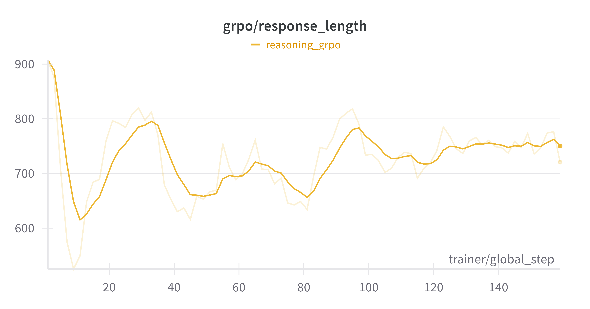</td>
<td>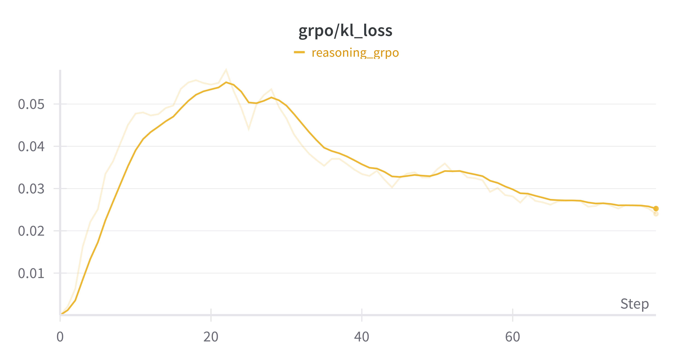</td>
</tr>
</table>

<table>
<tr>
<td>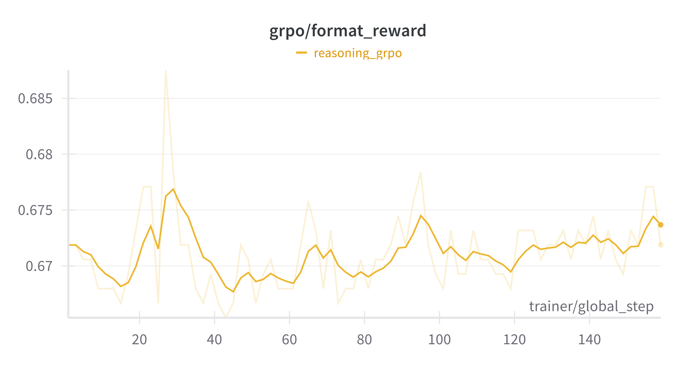</td>
<td>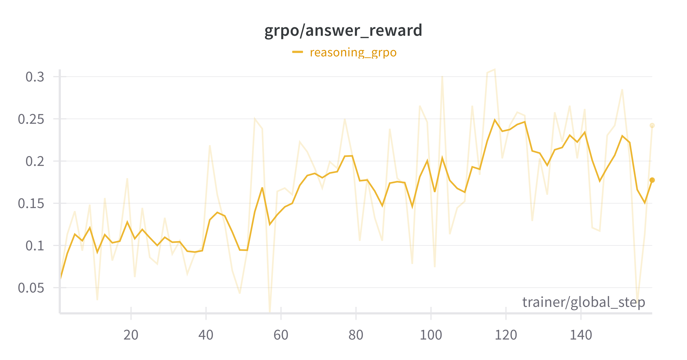</td>
</tr>
</table>

可以发现模型的response length从>1k的长度快速缩短至500，随后逐步稳定在700 tokens左右，对应的KL loss则出现了先快速上上在下降至趋于平稳的过程。由于此时的ref model为经过DeepSeek-R1思维链SFT后的模型，因此思维链长度下降和KL Loss趋势是符合预期的，因为仅经过SFT的模型仅学习到了DeepSeek的长思维链形式，其内部存在有非常多的重复句段，导致整体思维链长度较长但对最终的推理正确率帮助不大。

而在rewards变化上，format reward长期维持在0.66附近，这主要是由于部分rollout长度过长被截断，导致没有输出最终的结束符，但整体很好的保持了`<think></think>`格式；answer reward则整体呈现上升趋势，从大约0.05上升至0.2-0.25。虽然因为batch size较小导致整体波动较大，但相关的曲线表明模型整体是朝着正确的方向训练。

接下来是训练不同阶段的rollout结果，以下是第0步的rollout:
```
"<think>Okay, let's tackle this knights and knaves problem. So we have three people: Riley, Samuel, and Liam. Each of them made a statement, and we need to figure out who's who.\n\nFirst, let's list out their statements:\n\n- Riley says: \"Liam is not a knave.\"\n- Samuel says: \"Riley is not a knave.\"\n- Liam says: \"Samuel is a knight if and only if Riley is a knight.\"\n\nHmm. Let's break this down step by step.\n\nStarting with Riley's statement: \"Liam is not a knave.\" If Riley is a knight, then his statement is true, so Liam must be a knave. If Riley is a knave, then his statement is false, meaning Liam is a knight.\n\nNow, let's look at Riley's statement. He says, \"Riley is not a knave.\" If Riley is a knight, then his statement is true, so Riley is a knave. If Riley is a knave, then his statement is false, so Riley is a knave.\n\nNow, let's consider possible scenarios.\n\nCase 1: Riley is a knight. Then his statement is true, so Riley is a knave. Then, Riley's statement is false, so Riley is a knight. Now, Riley is a knight, so his statement \"Liam is not a knave\" is false. Since Liam is a knight, his statement is true, so Liam is a knave. Now, Liam's statement: \"Samuel is a knight if and only if Riley is a knight.\" Since Riley is a knight, the first part is true, so Riley is a knight. Now, Riley's statement: \"Samuel is a knight if and only if Riley is a knight.\" Since Riley is a knight, the second part is true. So Riley is a knave. Now, Riley's statement: \"Samuel is a knight if and only if Riley is a knight.\" Since Riley is a knight, the first part is true. So Riley is a knave. Now, Riley's statement: \"Samuel is a knight if and only if Riley is a knight.\" Since Riley is a knight, the second part is true. So Riley is a knave. Now, Riley's statement: \"Samuel is a knight if and only if Riley is a knight.\" Since Riley is a knight, the first part is true. So the entire statement is true. So Riley is a knave.\n\nNow, Liam's statement: \"Samuel is a knight if and only if Riley is a knight.\" Since Riley is a knight, the first part is true. So the \"if and only if\" part is true. So Liam's statement is true. Therefore, Liam must be a knave. If Liam is a knave, then his statement is false, so Liam is a knight.\n\nSo putting it all together:\n\nRiley is a knight (because his statement was true)\nRiley is a knave (since his statement was false, so he's a knight)\nLiam is a knight (since his statement was false, he's a knave)\n\nWait, but let's check the others' statements again.\n\nRiley's statement: \"Liam is not a knave.\" Since Riley is a knight, the first part is true, so the OR is true. So Liam is a knight. Then, Riley's statement: \"Samuel is a knight if and only if Riley is a knight.\" Since Riley is a knight, the first part is true. So the OR is true. So Riley is a knight. Then, Riley's statement: \"Samuel is a knight if and only if Riley is a knight.\" Since Riley is a knight, the first part is true. So the OR is true. So all three are knights. But wait, that's a problem. Because the problem doesn't state that there's at least one knave. So the answer would be all three are knights. But let's check again.\n\nWait, Riley's statement: \"Samuel is a knight if and only if Riley is a knight.\" Since Riley is a knight, the first part is true. So the OR is true. So Riley is a knight. Then, Riley's statement: \"Samuel is a knight if and only if Riley is a knight.\" Since Riley is a knight, the first part is true. So",
```

可以发现第0步的rollout大部分都被1024的token输出长度截断，并且其中存在有明显的重复句段，比如`Then, Riley's statement: \"Samuel is a knight if and only if Riley is a knight.\" Since Riley is a knight, the first part is true...`被重复了3次，这也证明了经过SFT对齐的模型仅学会了DeepSeek-R1思维链中的固定格式以及"反思/检查"形式，但并没有真正利用思维链进行有效的推理。之后是第80步的rollout:
```
"<think>Okay, let's try to figure out who's the knight and who's the knave here. We have three people: Scarlett, Benjamin, and Daniel. Each made a statement. Let's break down their statements and see what their roles are.\n\nFirst, Scarlett says, \"Daniel is a knave and Scarlett is a knight.\" Wait, that's a contradiction. Because if Scarlett is a knight, then her statement must be true. But if Scarlett is a knave, then her statement is false, meaning both parts of the OR must be true. But the statement is a contradiction, so the negation of \"Daniel is a knave and Scarlett is a knight\" is always true. Therefore, Scarlett is a knave. Because if Scarlett is a knave, then her statement is false, meaning both parts are false. But if Scarlett is a knave, then the statement is false, so the negation of \"Daniel is a knave and Scarlett is a knight\" is true. But since Scarlett is a knave, the first part is false. So the entire statement is true, which aligns with Scarlett being a knave. Therefore, Scarlett is a knave.\n\nNow, Benjamin says, \"Daniel is a knave and Scarlett is a knight.\" Let's parse that. Let's assume Benjamin is a knight. Then his statement is true, so both parts are true. If Benjamin is a knight, then his statement is true, so both parts are true. But if Benjamin is a knight, then his statement is false, so the first part is true, but the second part is false, so the first part is false. Therefore, Benjamin must be a knight. Because if he's a knight, his statement is true, so he's a knave. So Benjamin is a knight.\n\nSo putting it all together: Scarlett is a knave, Benjamin is a knight, Daniel is a knave.\n</think>(1) Scarlett is a knave\n(2) Benjamin is a knight\n(3) Daniel is a knave</s>"
```

可以看出此时reasoning中的重复现象有了一定的缓解，且该rollout正确推理出了答案。但可以发现模型在首先推理`\"Daniel is a knave and Scarlett is a knight.\"`这句话时说`Because if Scarlett is a knight, then her statement must be true. But if Scarlett is a knave, then her statement is false, meaning both parts of the OR must be true. But the statement is a contradiction, so the negation of \"Daniel is a knave and Scarlett is a knight\" is always true. Therefore, Scarlett is a knave.`，其中出现了非常跳跃的结论推理，同时在针对Benjamin的推理中引用了错误的条件，这意味着模型最终的正确答案可能与reasoning关系不大。之后是第158步的rollout结果：
```
<think>Okay, let's try to figure out this knights and knaves problem. There are three people: Avery, Noah, and Harper. Each made a statement, and we need to determine who's a knight (truth-teller) and who's a knave (liar).\n\nFirst, let's break down each person's statement.\n\nAvery says, \"If Avery is a knight then Harper is a knave.\" That's a conditional statement. In logical terms, that's A \u2192 B. In logical terms, this is equivalent to A \u2228 B. So if Avery is a knight, then Harper must be a knave. If Avery is a knave, then Harper must be a knight.\n\nNoah says, \"Harper is a knave or Avery is a knight.\" That's a conditional statement. In logic, an implication \"If P then Q\" is only false if P is true and Q is false. So if Noah is a knight, then Harper is a knave. If Noah is a knave, then Harper is a knight.\n\nHarper says, \"Harper is a knave or Avery is a knight.\" That's a conditional statement. In logic, an implication \"If P then Q\" is only false if P is true and Q is false. So if Harper is a knight, then the statement must be true. If Harper is a knave, then the statement must be false. So the statement is false (Harper is a knave), which is a contradiction because Harper can't be a knight. Therefore, Harper must be a knave. Wait, but if Harper is a knave, then the statement is false. The statement is A \u2192 B. So if Harper is a knave, then A \u2192 B must be false. Since A is false (A is true), the statement is true regardless of B. So if Harper is a knave, then the statement is false, which would mean Harper is a knight. Therefore, Noah's statement is true, which aligns with Harper being a knave. So Noah is a knight.\n\nNow, if Noah is a knight, then Harper is a knave. Then Harper's statement is \"Harper is a knave or Avery is a knight.\" Since Harper is a knave, the second part is false. For the entire statement to be false, Harper must be a knight. So Harper is a knave (which we already know is true) and A is true (A is true). So if Noah is a knight, Harper is a knave.\n\nNow, Harper's statement: \"Harper is a knave or Avery is a knight.\" Since Harper is a knave, the second part is false. So the entire statement is false. Therefore, Harper is a knight.\n\nNow, let's consider possible scenarios. Let's assume Avery is a knight. Then his statement is true. So Harper is a knave (true) and Avery is a knight (false). If Avery is a knight, then Harper is a knave. But we assumed Harper is a knight. Then Harper's statement is \"Harper is a knave or Avery is a knight.\" Since Harper is a knave, the second part is true. So the entire statement is true regardless of A. So Noah's statement is true. Therefore, Noah is a knight.\n\nSo putting it all together: Avery is a knight, Noah is a knight, Harper is a knave.\n</think>(1) Avery is a knight\n(2) Noah is a knight\n(3) Harper is a knave</s>
```

可以发现此时整体的rollout条理性有了一定的提升，无意义的重复有一定减少，并且使用了形式化的推理进行表述，整体情况相比初始模型有了明显的改善。

为了量化的探究GRPO对模型推理性能的提升，我继续使用3ppl的KK测试集进行验证，其中最大回复长度设置为2048，不同rollout次数下模型的pass rate如下：
| Rollout | SFT Pass Rate | GRPO Pass Rate |
| --- | --- | --- |
| 1 | 7% | 20% |
| 3 | 24% | 34% |
| 16 | 68% | 56% |

可以看出经过GRPO的模型在pass@1上提升了2倍，在pass@3上提升了约41%，但在pass@16上反而下降了约17%，这个结论与这篇论文中的观点[^yue2025RL]一致，即模型对复杂推理任务的解决能力上界在base model中已经定型，GRPO等现有RL算法主要让模型更倾向于优先采样"正确"答案，即提高pass@1通过率，但当答案采样变多时，RL对模型输出多样性和探索空间的约束反而让经过RL的模型在pass@k上低于base model

---

<div align="center">
<h3>推理优化</h3>
</div>

### 变长推理
**Background**&emsp; 在单人用户对话中，LLM可能仅需要处理batch = 1的情况，但在跑benchmark或多用户场景，对batch inference的支持能够极大的提升GPU的利用率。一般来说，batch inference仅需要对输入的token进行左padding即可，但在LLM主要阶段全部使用padding-free策略进行训练的情况下，模型会难以处理很少见到的\<pad\> token，导致注意力无法正确关注到正文内容。即使在将pad token替换为eos token后仍然难以缓解该问题。

作为示例，模型的输入选择了一些短问题 + 长段的数学CoT，对应的batch inference结果如下：
```
0: <pad><pad><pad><pad><pad><pad><pad><pad><pad><pad><pad><pad><pad><pad><pad><pad><pad><pad><pad><pad><pad><pad><pad><pad><pad><pad><pad><pad><pad><pad><pad><pad><pad><pad><pad><pad><pad><pad><pad><pad><pad><pad><s><user>能否解释一下Transformer架构呢？</s>
<s><bot>**Respondue:**

**Issue:** **Issue:** **Issue:**...
1: <pad><pad><pad><pad><pad><pad><pad><pad><pad><pad><pad><pad><pad><pad><pad><pad><pad><pad><pad><pad><pad><pad><pad><pad><pad><pad><pad><pad><pad><pad><pad><pad><pad><pad><pad><pad><pad><pad><pad><pad><s><user>Could you please give a C++ example for quick sort?</s>
<s><bot>**Issue: Ensure the Invalid Code (PAT)**

**Issue: Easier to C++**

**Issue: Easier to C++**

**Issue: Easier to C++**
...
2: <pad><pad><pad><pad><pad><pad><pad><pad><pad><pad><pad><pad><pad><pad><pad><pad><pad><pad><pad><pad><pad><pad><pad><pad><pad><pad><pad><pad><pad><pad><pad><pad><pad><pad><pad><pad><pad><pad><pad><pad><pad><s><user>Could you please tell me a joke about the weather?</s>
<s><bot>Certainly, here's a list of common concerns:

1. **Temperature Issues**:
   - **Temperature Issues**: Toxic (high) and temperature (high).
   ...
3: <s><user><s><user>Given that $b$ is a multiple of $2373$, find the greatest common divisor of $b^2 + 13b + 40$ and $b + 5$. You could think it step by step.</s>
<s><bot>To determine the greatest common divisor (GCD) of $b^2 + 13b + 40$ and $b + 5$, we follow these steps:

1. **Identify the GCD of $b^2 + 13b + 40$:**
   - The prime factorization of $b^2 + 13b + 40$ is $b^2 + 13b + 40$.
   - Therefore, the GCD of $b^2 + 13b + 40$ and $b + 5$ is $b^2 + 13b + 40$.

2. **Express $b^2 + 13b + 40$ in terms of $b$:**
   - We start by expressing $b^2 + 13b + 40$ in terms of $b$ using the difference of squares formula:
     \[
     b^2 + 13b + 40 = (b + 5)(b - 2)
     \]
   - We then apply the difference of squares formula:
     \[
     (b + 5)(b - 2) = b^2 + 2b + 2
     \]
   - Rearrange to isolate $b^2 + 2b + 2$:
     \[
     b^2 + 2b + 2 = b^2 + 2b + 2 - b^2 - 2b + 2 = b^2 + 2b - 2b + 1
     \]
   - Further simplification gives:
     \[
     b^2 + 2b - 2b + 1 = 1
     \]

3. **Factorize $b^2 + 13b + 40$:**
   - We now have:
     \[
     b^2 + 13b + 40 = 1 + 13b + 40
     \]
   - To find the GCD, we need to find the values of $b$ that make the expression $1 + 13b + 40$ a multiple of $3$.

4. **Solve the equation:**
   ...
```

可以发现，在\<pad\>占据主要输入的情况下，模型的输出内容受到了明显影响，仅有不包含\<pad\>的数学CoT回答仍然保持正常。

将tokenizer的\<pad\>替换为结束符，对应的输出结果如下：
```
0: </s></s></s></s></s></s></s></s></s></s></s></s></s></s></s></s></s></s></s></s></s></s></s></s></s></s></s></s></s></s></s></s></s></s></s></s></s></s></s></s></s></s><s><user>能否解释一下Transformer架构呢？</s>
<s><bot>提创意的「�家。年迈时，</s>
1: </s></s></s></s></s></s></s></s></s></s></s></s></s></s></s></s></s></s></s></s></s></s></s></s></s></s></s></s></s></s></s></s></s></s></s></s></s></s></s></s><s><user>Could you please give a C++ example for quick sort?</s>
<s><bot>茙�，</s>
2: </s></s></s></s></s></s></s></s></s></s></s></s></s></s></s></s></s></s></s></s></s></s></s></s></s></s></s></s></s></s></s></s></s></s></s></s></s></s></s></s></s><s><user>Could you please tell me a joke about the weather?</s>
<s><bot>治育活２

新新饮用等社交软件。�和。�和，</s>
```

可以发现，模型虽然能够正确预测结束符，但是输出内容同样受到了影响。

为了解决这个问题，Sophie0在Huggingface的GenerateMixin，Cache框架下额外实现了兼容varlen inference的流程。作为测试，我选择了相同的生成参数，仅将与varlen inference关联的`use_varlen_inference`打开，对应的生成结果如下：
```
0: <pad><pad><pad><pad><pad><pad><pad><pad><pad><pad><pad><pad><pad><pad><pad><pad><pad><pad><pad><pad><pad><pad><pad><pad><pad><pad><pad><pad><pad><pad><pad><pad><pad><pad><pad><pad><pad><pad><pad><pad><pad><pad><s><user>能否解释一下Transformer架构呢？</s>
<s><bot>Transformer架构（Generative Adversarial Networks，GAN）是一种基于Transformer架构的神经网络架构，它通过一个卷积神经网络（GAN）来生成输出、预测和生成输出。GAN架构通过一个卷积层（Convolution）层，将输入的输入转换为输入输出，再通过一个卷积层来生成输出。GAN架构的核心是损失函数，它将输入的输出映射到输入层，然后通过损失函数将输出映射到输出层，最终输出输出。
GAN架构的基本思想是通过一个卷积层来生成输出，并将输出映射到输出层。GAN架构的核心是损失函数，它将输出映射到输出层，然后通过损失函数将输出映射到输出层，最终输出输出。
Transformer架构在图像识别、语音识别、自然语言处理、推荐系统等多个领域中发挥着重要作用。</s>
1: <pad><pad><pad><pad><pad><pad><pad><pad><pad><pad><pad><pad><pad><pad><pad><pad><pad><pad><pad><pad><pad><pad><pad><pad><pad><pad><pad><pad><pad><pad><pad><pad><pad><pad><pad><pad><pad><pad><pad><pad><s><user>Could you please give a C++ example for quick sort?</s>
<s><bot>Certainly! The C++ example for quick sort is as follows:

\```cpp
#include <iostream>
#include <vector>
#include <algorithm>

using namespace std;

// Function to sort elements of a vector
vector<int> sort(vector<int>& arr) {
    for (int i = 0; i < arr.size(); i++) {
        for (int j = 0; j < arr[i].length; j++) {
            if (arr[j] > arr[i]) {
                arr[j] = arr[i];
                arr[i] = arr[j];
            }
        }
    }
}

int main() {
    vector<int> arr = {1, 2, 3, 4, 5, 6, 7, 8, 9, 10};
    sort(arr);
    return 0;
}
\```

In this example, we define a function `sort` that takes an array (`arr`) and an integer (`arr[i]`) as input. Inside the function, we use the `std::sort` function to sort the elements of the array. The `sort` function takes three parameters: `arr`, `arr`, and `arr[i]`. 

The `sort` function takes three parameters: `i`, `j`, and `arr[i]`. It compares the elements at indices `i` and `j` in the array and assigns the corresponding values to `arr[i]` and `arr[j]`. The `sort` function is then used to sort the array in ascending order.

By using this code, you can easily sort any given array in ascending order.</s>
2: <pad><pad><pad><pad><pad><pad><pad><pad><pad><pad><pad><pad><pad><pad><pad><pad><pad><pad><pad><pad><pad><pad><pad><pad><pad><pad><pad><pad><pad><pad><pad><pad><pad><pad><pad><pad><pad><pad><pad><pad><pad><s><user>Could you please tell me a joke about the weather?</s>
<s><bot>Why did the weather go to ruin the town? Because it had a very cold winter, the weather was a constant.</s>
3: <s><user><s><user>Given that $b$ is a multiple of $2373$, find the greatest common divisor of $b^2 + 13b + 40$ and $b + 5$. You could think it step by step.</s>
<s><bot>To determine the greatest common divisor (gcd) of \(b^2 + 13b + 40\) and \(b + 5\):

1. **Identify the GCD of the two numbers:**
   - The greatest common divisor (GCD) of \(b^2 + 13b + 40\) and \(b + 5\) is given by \(b^2 + 13b + 40\).
   - Here, \(b = 2373\).
   - Thus, the GCD is \(2373\).

2. **Apply the Euclidean Algorithm:**
   - Apply the Euclidean algorithm to find the GCD:
     \[
     \text{GCD}(2373, 2373) = 2373
     \]
   - Calculate \(2373\):
     \[
     2373 = 2 \times 3 \times 7 \times 13
     \]
     \[
     2373 = 6 \times 7 \times 13
     \]
     \[
     2373 = 429 \times 13
     \]
     \[
     2373 = 1199 \times 13
     \]
     \[
     1199 = 13 \times 13
     \]
     \[
     1199 = 13 \times 23
     \]
     ...
```

可以发现，varlen inference保证了模型对batch中短prompt输出的正确处理，证明了其有效性

**Implementation**&emsp; 为了兼容Huggingface的主框架，varlen inference的外部输入需与原始框架完全一致，而对应的序列索引等信息则需要在推理时实时生成。其主要的改动点集中在以下几个地方：

- `prepare_inputs_for_generation`: 在该函数中，Sophie0需要生成当前步中对应query的`cu_seqlens`，并在最开始的prefill阶段将prompt转换为padding-free形式(直接使用flash_attention的相关函数)
- `VarlenCache`: 在该类中，Sophie0需要维护varlen形式的KV Cache以及KV的`cu_seqlens`，同时负责将当前新的KV插入到之前的Cache对应的位置中
- `Attention`: 在注意力层，Sophie0使用与训练时一致的varlen attention算子，不过需要注意query和KV对应着不同的序列索引
- `Output`: 在得到模型的当前步输出后，需要通过`cu_seqlens`提取出每个序列最后的token，作为当前步生成的新token

对于核心的KV Cache，Sophie0直接对每一个request单独维护一个KV Cache，所有request的Cache以`Tuple[Tensor]`的形式维护，每一步的新KV Cache会先通过每个request的生成长度对Cache进行split后直接concat进入对应的Cache，随后通过单独的concat函数生成flash_attn能够处理的KV Cache形式。为了验证Varlen Cache中的额外操作对整体吞吐量和显存占用的影响，我使用经过Reasoning SFT阶段的checkpoint对kk_3ppl的100条测试集进行单batch 10-shot推理，两种策略对应的吞吐量和显存峰值占用如下：
| | Vanilla Inference | Varlen Inference |
| --- | --- | --- |
| Mem. Usage | 6.75GB | 4.89GB |
| Speed | 178.92s/it | 224.11s/it |
| Max GPU Utilization | 55% | 46% |

可以发现，Varlen形式的管理导致了大约25%左右的吞吐量下降，但相对的节省了27.5%的峰值显存占用，这个优势在多batch变长推理的情况下会进一步扩大。同时，由于Sophie0在除去pretrain以外的阶段均使用了varlen形式完成训练，因此padding-free形式的推理策略对于Sophie0来说也是十分必要的

---

### References
[^sardana2024ChinchillaOptimal]: Beyond Chinchilla-Optimal: Accounting for Inference in Language Model Scaling Laws. Sardana, Nikhil, et al. ICML'24.

[^liu2024RPO]: Provably Mitigating Overoptimization in RLHF: Your SFT Loss is Implicitly an Adversarial Regularizer. Zhihan Liu, et al. NeurIPS'24.

[^yue2025RL]: Does Reinforcement Learning Really Incentivize Reasoning Capacity in LLMs Beyond the Base Model? Yue Yang, et al. arXiv:2504.13837.